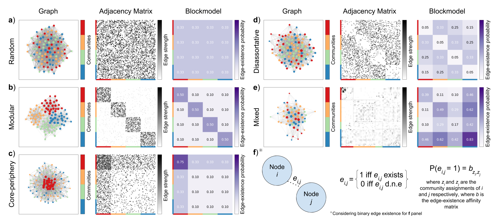

blockmodeltools (beta)
==============================

Toolbox of functions designed to aid in the usage of the [wsbm package](http://tuvalu.santafe.edu/~aaronc/wsbm/). Work on these tools is ongoing.

The WSBM is an egde-generative model of community structure. Notably, it can identify community strucutre topologies beyond modularity (internally dense, externally sparse), such as core-periphery and disassortaitve structures. 

These tools have been used to identify [community structure changes across the lifespan](https://github.com/faskowit/Faskowitz2018wsbmLifeSpan) and to evaluate [community structure patterns of the rat cortex connectome](https://github.com/faskowit/Faskowitz2019wsbmRatBrain).

Figure of various community structure topologies.

 This material is based upon work supported by the National Science Foundation Graduate Research Fellowship under Grant No. 1342962. Any opinion, findings, and conclusions or recommendations expressed in this material are those of the authors(s) and do not necessarily reflect the views of the National Science Foundation. 
